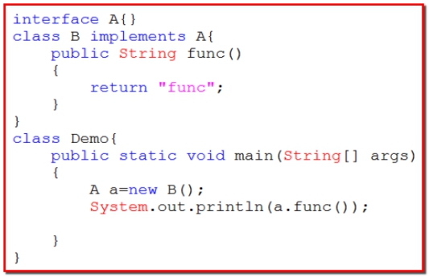
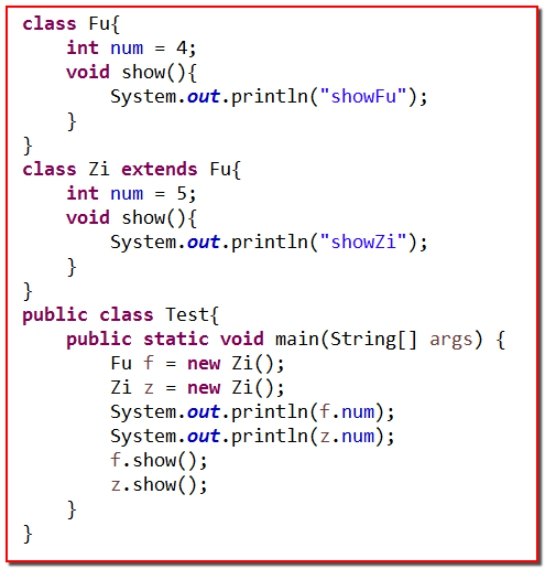

# 选择题
## 题目1
下面代码编译运行结果是：()


A：编译出错；

B：编译通过，但运行出错；

C：编译运行都正常，输出”func”

D：编译运行都正常，但没有任何输出结果；

答案 A

## 题目2
下面说法正确的是：（）

A：多态就是父类型引用操作子类对象，或者接口类型引用操作实现类对象；

B：多态可以提高程序的复用性和耦合性；

C：多态中父类型引用不能操作子类特有成员，因为运行时发现父类中没有子类的特有成员；

D：多态的好处是不需要使用子类特有成员，降低程序的复杂度；

答案 A

## 题目3


A：编译失败

B：编译成功，但运行出错

C：编译运行都成功，输出4,5，showFu，showZi

D：编译运行都成功，输出4,5，showZi，showZi

## 题目4
下面说法正确的是：（）

A：Java中的接口使用interface关键字声明，在接口中只能书写抽象函数和使用public	static 	final修饰的成员变量；

B：Java中的抽象类可以继承多个接口；

C：Java中的接口里面没有构造函数；

D：Java中的类可以同时实现多个接口，一个接口也可以继承多个接口，没有任何限制；

答案 C

## 题目5
下面说法正确的是：（）

A：抽象类和接口都一定有抽象方法，不能直接创建对象，需要由子类继承或者实现；

B：抽象类和接口中都没有构造方法，不能直接创建对象；

C：抽象类是用来描述一个继承体系中所有子类的共有属性和行为的；接口更多的用来描述功能的集合，用来定义规则的；

D：接口和抽象类都只能是单一继承；

答案： C

## 题目6
下列说法错误的是：（）

A：Java中，一般使用static和final关键字共同修饰的成员变量表示常量；

B：Java中，使用private关键字修饰的成员，只能在本类中使用，不能在其他类中使用；
C：Java中，要想避免一个方法被子类重写，应该使用final关键字修饰；

D：Java中，protected修饰符修饰的成员，可以被不同包中的子类继承；

答案： B

## 题目7
下面说法正确的是：（）

A：static关键字可以修饰类中所有成员；

B：static关键字不能用来修饰构造方法；

C：static关键字不能修饰类；

D：static关键字修饰的方法中可以使用this关键字；

答案： B

## 题目8
根据需求，补齐代码


```$xslt
class C implements A,B{
    int sum = 0;
    public void add(int number1, int number2){
        this.sum = number1 + number2;
    }
    public void show(){
        System.out.println(this.sum);
    }
}
```

## 题目9
请问 static 关键字可以修饰那些元素？它们分别代表什么意义？
static 关键字可以使用在类，成员方法，成员变量，构造方法，局部变量上。

## 题目10
请问static修饰的成员变量在内存中有什么特点
static修饰的成员变量，此变量属于类变量，或者静态变量，属于类的，不在属于对象自己，存放在静态区，只能有一份，为所有变量共享。

## 题目11
请问被static修饰的成员可以怎样调用它们？
static 修饰的成员变量可以通过类外加方法名进行调用。

# 问答题
## 题目1
子类实现接口使用什么关键字？
子类实现接口，使用import关键字。

## 题目2
子类实现接口后有什么要求？
子类实现接口，需要重写接口中的方法。

## 题目3
子类是否可以同时实现多个接口？
子类可以同时实现多个接口。

## 题目4
子类是否可以在继承一个类的同时实现多个接口。
子类可以在继承一个类的同时实现多个接口。

## 题目5
接口是否可以继承一个或多个接口？
接口可以继承一个或多个接口。

